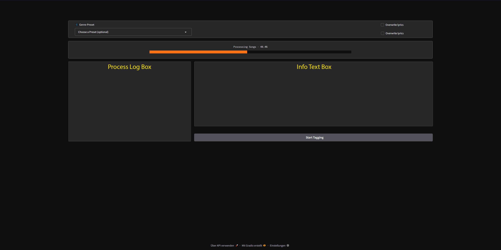

<h1 align="center">🎵 ACE-DATA v2 – ACE-Step Data Tool</h1>
<p align="center">
  <strong>Lokales Automations-Tool für Lyrics, Tags & BPM – kompatibel mit ACE-Step</strong><br>
  <em>Extrahiert Lyrics, generiert strukturierte Prompt-Tags & ermittelt BPM – lokal mit Gradio; LLM: Ollama (v1) oder MuFun (HF, v2)</em>
</p>

<p align="center">
  
  
  
  
  
</p>

<p align="center">
  
</p>

## ✨ Features (v2 Status)
- 🎙️ Automatisches Lyrics-Scraping (Genius) mit Cleaning-Pipeline
- 🧠 LLM-basierte Tag-Generierung (Genre, Mood, Rap-Style, Vocals, Instrumente, BPM)
- 🎚️ Robuste BPM-Erkennung (Librosa + Percussion-Fokus + Normalisierung)
- 💾 Automatische Ausgabe von `*_lyrics.txt` & `*_prompt.txt`
- 🧩 Tags: lowercase-hyphenated, max. 2 Genres, BPM-Tag forciert
- 🖥️ Minimalistische Gradio WebUI (nur Kern-Workflow – Advanced Tabs folgen später)
- 🔁 Retry-/Recovery-Strategien (Ollama) bzw. Fallback chat→generate (MuFun)
- 🪵 Zentrales Logging (`shared_logs.py`)
- ⚙️ Konfigurierbar über `config/config.json`
- 🧹 Lyrics-Cleanup vor Tagging (Entfernung Intro-Müll bis erste [Section])

## 📦 Aktueller Projektstatus vs. v1
| Bereich            | v1                                     | v2 (jetzt) |
|--------------------|----------------------------------------|------------|
| Ordnerstruktur     | teils redundant                       | konsolidiert (helpers, include, scripts) |
| BPM                | einfache Schätzung                     | stabilisierte Perkussion + Faltung |
| Tagging            | generisch                              | Regelbasiert + BPM-Sicherung |
| UI                 | viele Controls                         | bewusst minimal |
| Metadata Helper    | doppelt / verstreut                    | vereinheitlicht |
| Logging            | teils print                            | zentral `log_message()` |
| Presets/Moods      | vorhanden                              | erweitert / reorganisiert |
| Export/Editor      | im UI                                  | aktuell ausgeblendet (kommt als Tab) |

## ⚙️ Installation
```bash
# 1. Repository klonen
git clone https://github.com/methmx83/ACE-DATA_v2.git
cd ACE-DATA_v2

# 2. (Optional) Virtuelle Umgebung
python -m venv .venv
# Windows:
.venv\\Scripts\\activate

# 3. Abhängigkeiten
pip install -r requirements.txt
# oder (editable)
pip install -e .

# 4. NLTK einmalig vorbereiten
python -c "import nltk; nltk.download('vader_lexicon'); nltk.download('stopwords')"

# 5. Ollama installieren & Modell ziehen
ollama pull dein-modell
```

## 🔧 Konfiguration (`config/config.json`)
Aktuelles Beispiel (MuFun, lokal):
```json
{
  "input_dir": "data/audio",
  "hf_model_path": "Z:/AI/projects/.models/generative/mufun",
  "use_audio": true,
  "audio_max_seconds": 45,
  "downsample_hz": 16000,
  "empty_cache_between_files": true,
  "debug": false,
  "gen_max_new_tokens": 64,
  "gen_temperature": 0.2,
  "gen_top_p": 0.9,
  "gen_repetition_penalty": 1.1
}
```
- input_dir: Root mit Audiodateien (rekursiv)
- hf_model_path: Lokaler Ordner des MuFun-Modells (oder leer für HF-Download)
- use_audio: Audio dem LLM übergeben (True) oder nur Text-Prompt
- audio_max_seconds/downsample_hz: Optionales Vorverarbeiten
- empty_cache_between_files: GPU-Cache leeren nach Datei
- gen_*: Generations-Grenzen für kurze/stabile Antworten

## 🚀 Quickstart
```bash
# Start (Batch)
RUN.bat
# oder direkt
python -m webui.app
```
Dann öffnen: http://127.0.0.1:7860

1. MP3/WAV/FLAC nach `data/audio/` legen  
2. (Optional) Preset auswählen  
3. Häkchen für Überschreiben setzen falls nötig  
4. Start Tagging  
5. Ausgabe:
```
song.mp3
song_lyrics.txt   # Bereinigte Lyrics
song_prompt.txt   # Tags: bpm-92, dark, german-rap, male-vocal, bass-heavy, ...
```

## 🧠 Tag-Format & Regeln
- Alle lowercase, mit `-` statt Leerzeichen
- Max. 2 Genre-Tags
- Mindestens: vocals, instrument(e), mood, rap-style (falls passend)
- BPM-Tag: `bpm-XXX` (falls ermittelt)
- Moods/Styles: Referenz in `include/Moods.md`
- LLM-Ansteuerung: Ollama (Chat-API) ODER MuFun (HF lokal, chat→generate Fallback)

## 🥁 BPM-Erkennung (Kurz)
Pipeline:
1. Laden & Resample
2. HPSS → Percussion
3. Onset Strength Envelope (median)
4. Librosa tempo() mit Start-Prior
5. Halftime/Double-Korrektur in Zielbereich (70–180)
6. Near-Integer Snap
Rückgabe: Integer oder None → `bpm-<wert>` oder (fallback) Modell darf selbst einschätzen (vermeiden wir aber soweit möglich).

## 📁 Struktur (v2)
```
ACE-DATA_v2/
├── webui/            # Gradio UI (minimal)
├── scripts/          # Kernlogik (lyrics, tagger, moods, helpers)
│   └── helpers/      # bpm, lyrics_cleaner, ...
├── include/          # Moods.md, metadata, clean_lyrics
├── config/           # config.json
├── data/audio/       # Input + Output (Lyrics/Tags)
└── docs/             # Mehrsprachige Doku
```

## 🔍 Logging
- Alle Statusmeldungen zentral über `shared_logs.log_message()`
- UI zeigt letzte ~1000 Einträge
- (Optional) Später: Persistenz in Datei

## 🛡️ Hinweise
| Thema | Hinweis |
|-------|---------|
| Scraping | Nur Lyrics nutzen, für die du Rechte zur Verarbeitung hast |
| GPU | 8 GB VRAM ausreichend für kompaktes Modell |
| RAM | ~2–3 GB Laufzeitverbrauch + Modell |
| Audio-Mengen | Viele Dateien → I/O Bound; BPM kann CPU-lastig sein |
| Fehlerfälle | Leere Lyrics → Tagging wird übersprungen |

## ❗ Bekannte ToDos (Geplant)
- Neuer Tab: Prompt-Editor / Export-Funktion (reintegrieren)
- Optional: Caching von BPM pro Datei (JSON/SQLite)
- Tests: Unit-Tests für Tag-Parsing & BPM-Snap
- Changelog-Datei (siehe unten)

## 🧾 Changelog
Siehe `CHANGELOG.md` im Repository.

## 🧩 Kompatibel mit
- ACE-Step (Dataset-Aufbereitung)
- Lokale Ollama Modelle (Qwen, DeepSeek, Mistral, etc.)
- LoRA / Fine-Tuning Pipelines

## 📜 Lizenz
- Code: MIT
- Inhalte (Moods, Screenshots, ggf. generierte Datenbeispiele): CC BY-NC 4.0

---

*Automatisiere deinen Audio-Datenaufbau – schnell, lokal, strukturiert.*

## 🤝 Beiträge, Issues & PRs
- Bitte nutze die Vorlagen unter `.github/ISSUE_TEMPLATE/`:
  - Bug report
  - Feature request
  - Improve Tag Diversity (MuFun)
- Pull Requests bitte mit Template `.github/PULL_REQUEST_TEMPLATE.md` erstellen und auf ein Issue referenzieren (z. B. "Closes #123").
- Projektkontext: siehe `docs/CONTEXT.md`.
